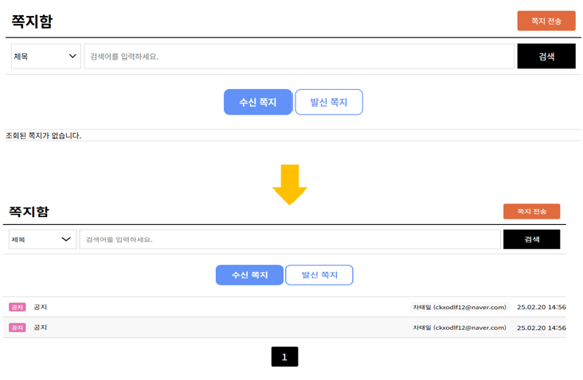

포켓몬 클론코딩 프로젝트 (기초 학습 & 단일 구조)
포켓몬 API를 활용한 단일(모놀리식) 프로젝트를 통해 백엔드 흐름, API 설계, DB 연동 등 웹 서비스의 기본 구조를 익혔습니다.

포켓몬 프로젝트 이후에는 Config Server, Eureka, Gateway, 개별 서비스들로 나누어 마이크로서비스 아키텍처(MSA) 기반의 실전 프로젝트를 진행했습니다.
Docker로 컨테이너화하고 AWS ECS에 배포하면서 서비스 분리 및 배포 자동화의 흐름을 체험했습니다.
Anonymous 프로젝트 (MSA 기반 실전 적용) 진행 중
기존 모놀리식 프로젝트의 설정을 Config Server를 통해 외부화하면서 다음과 같은 문제들이 발생했습니다.

- 로컬 환경에서도 서비스 실행 오류
- {redis.host}, {db.username} 등 환경 변수 미지정 오류
- Config Server와 실제 서비스 간 연동 실패
- Eureka 및 Gateway 서비스 연결 불안정

하여 현재 하기 방향으로 조치 중입니다.

- 환경 변수 지정 누락 확인 및 application.yml 분리 구조 정비
- Config Server 연동 테스트 및 profile 분리 재구성
- 로컬 테스트 환경과 운영 배포 환경을 명확히 분리
- 실행 순서 재확인
- 버전 충돌 정리 및 이미지 버전 관리 확인

문제를 정리하고 하나씩 해결해 나가고 있으며 실행 가능한 구조로 재정비하는 중입니다.

# 구성
메인화면

## 1. 로그인
   
### 회원가입 1 (기본)
- 필수약관동의 후 가입가능하게 제한
- 이메일 주소, 회원명, 닉네임, 생일, 성별, 주소입력
  - 이메일 검증필수
  
구분방식 : 이메일 로그인

### 회원가입 2 (소셜 로그인-카카오)
- 소셜 로그인을 선택시 인증 후 비밀번호 제외한 나머지 양식 작성

### 계정 관리
비밀번호 만료 - 변경시점으로 부터 30일 간격 동일 비밀번호인 경우 비밀번호 수정후 접속 가능

## 2. 마이페이지
- 작성한 게시물 확인
- 쪽지함 ( 보낸 쪽지, 받은 쪽지 확인 )

- 찜한 목록 확인 ( 포켓몬, 게시글 ) / 포켓몬 이미지 좌측 상단에 하트로 구분 / 재 클릭시 즐겨찾기 해제

- 회원 정보 수정 : 프로필이미지, 비밀번호/비밀번호 확인, 닉네임, 주소 / 이메일 수정 불가

- 소셜 연결
카카오 로그인 연결

## 1-1. 관리자 로그인

로그인
사이트관리
1. 기본설정 -> 버전관리, 사이트관련 설정
2. 회원관리 -> 가입한 회원의 강제탈퇴, 가입이력확인 및 회원정보수정 

3. 게시판 관리
  게시판 목록, 등록, 관리
  공지사항 작성 가능

4. 상품관리

---

도감으로 이동

분류 기준에 따른 검색기능

도감번호별 정렬

포켓몬 타입 별 정렬 

게시판
공지사항 (상단고정)

최신 순으로 정렬, 검색기능 추가

게시판
로그인 / 비회원 로그인 구분

-> 비회원은 비밀번호입력시 게시글 작성가능 ( 추후 비밀번호로 게시글 삭제가능 )
조회수가 높은 순으로 정렬 / 조회수 동일할 시 최신 순 정렬

포켓몬 상품
상품으로 이동

---
### 추가하고 싶은거

포켓몬 게임
- 포켓몬 그림자 이미지 보고 이름 맞추기 게임 (주관식)

메인페이지 통합검색기능 ( 검색창처럼 )
카테고리 내 모든 내용 검색 가능

실시간 채팅

마우스효과 ( 포켓볼 또는 반짝이같은거 )

내 위치기반 주변 포켓몬 스토어 검색 ( 지도확인가능하게 옆에 추가 )
참고사이트 : https://pokemonkorea.co.kr/pokemon_cardshop/menu211

